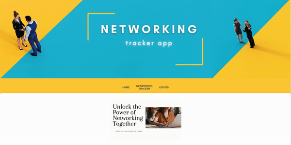

# Networking Tracker App (MERN Full Stack) 🌐🚀

The Networking Tracker App is a comprehensive MERN full stack application designed to simplify and organize your networking efforts. It leverages MongoDB, Express, React, and Node to provide a seamless user experience. The app also utilizes Sass for styling and Vite as a development tool. ✨

## Features ✨

- 📇 Contact Management: Easily add, edit, and organize your networking contacts in one place. Capture essential details such as name, email, phone number, notes, company information, and location.

- 📅 Event Tracking: Seamlessly plan and track networking events. Set reminders, manage RSVPs, and keep a record of past events for effective follow-ups and relationship management.

- 📝 Notes and Tags: Add personalized notes and tags to your contacts for efficient networking. Jot down important details, observations, or action items to stay organized and stay on top of your networking activities.

- 🏢 Company Details and Locations: Store and access information about companies or organizations related to your networking contacts. Integrate location services to associate event venues and meeting places with your contacts and events.

## Installation 🛠️

1. Clone the repository: 
Frontend:
`git clone https://github.com/julianavalenti/networking-tracker-frontend`
Backend:`git clone https://github.com/julianavalenti/networking-tracker-backend`
2. Navigate to the project directory: `cd networking-tracker-app`
3. Install dependencies: `npm install`

## Usage 🚀

1. Start the app: `npm start`
2. Open your web browser and visit `http://localhost:3000` to access the app.
3. Create an account or log in with your existing credentials.
4. Start adding contacts, managing events, and unleashing your networking superpowers! 💪

## Technologies Used 🛠️

- 🍃 MongoDB: NoSQL database for storing and retrieving contact and event data.
- ⚡ Express: Backend web framework for building APIs and handling server-side operations.
- ⚛️ React: JavaScript library for building user interfaces.
- 🚀 Node: JavaScript runtime for executing server-side code.
- 💅 Sass: CSS preprocessor for enhanced styling capabilities.
- 🛠️ Vite: Development tool for fast and optimized web development workflow.

## product Overview 

## Future Changes and Additions 🚀

1. **Authentication and User Management**: Implement a secure authentication system to allow users to create accounts, log in, and manage their profiles. This will provide personalized experiences and protect user data.

2. Enhanced Styling and User Interface: Continuously improve the app's visual design and user interface to create a polished and engaging experience. Consider incorporating modern design trends, responsive layouts, and intuitive navigation.

3. **Integration with Google Calendar**: Enable integration with Google Calendar to allow users to sync their networking events and set up alarms and reminders. This integration will enhance event management and help users stay organized.

4. **Advanced Search and Filtering**: Implement advanced search and filtering options to allow users to quickly find specific contacts, events, or companies. Include features like keyword search, date range filtering, and sorting options.

## Contributing 👥

Contributions are welcome! If you encounter any issues or have suggestions for improvements, please open an issue or submit a pull request. Let's make networking more fun together! 🎉

## Deploy link:
[Click here to check deployed app](https://gorgeous-fox-950b17.netlify.app/)
